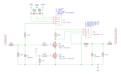
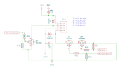

# Safety

This section describes the hardware-side safeties
that were implemented for the cryostorage chamber.
These safeties are as far as possible implemented in the circuit design,
meaning that they do not require firmware or software to properly work.
Caveats to these limitations are discussed below.

## Cryocooler safety

The cryocooler must not be run when there is no or insufficient cooling water.
Thus, not allowing the cryocooler to start when powering it up and ensuring
it powers down when cooling water is lost is crucial.

The cryocooler itself has two modes of operation:

- Computer control mode.
- Control via a digital input pin (so-called soft-stop mode).

If controlled via the digital input pin, the cryocooler runs
as long as this input line is grounded, i.e., at 0V.
If the input line is pulled up to 5V,
the cryocooler enters the soft-stop mode and comes to halt.

Above figure shows the wiring diagram for the cryocooler safety.
The following symbols are important in below discussion:

- J9: Connector to the flow meter.
- J10: Connector to the cryocooler.
- Q9: Water interlock MOSFET.
- Q10: Electronics interlock MOSFET.
- R32, D17: Voltage divider to bring 24V from flow meter down to 3.3V for MOSFET
  gate and digital read.
- R33: Resistance between 5V supply from cryocooler and Soft-Stop pin.

On the cryocooler connector J10, pin 1 supplies the 5V that is used
to turn off the cryocooler via the soft-stop (pin 2 on J10).
In normal operation (all okay), the soft stop pin is connected to ground
such that the voltage on this pin is 0V.
This connection to ground passes through two MOSFETS, Q9 and Q10.

### Water interlock

If the waterflow is high enough for running the cryocooler,
24V are supplied from pin 3 to pin 4 on the flow meter connector J9.
These 24V pass through the voltage divider R32 & D17 and turn this voltage
into 3.3V that closes the gate on MOSFET Q9. Thus, this MOSFET connect
drain and source when the water flow is fine.

If the waterflow fails or is too low,
pin 3 and 4 on J9 are not connected, the gate voltage on Q9
drops to 0V and opens the connection to ground between R33 and the soft-stop pin.
This results in 5V being applied to the soft-stop
and thus the cryocooler will stop.

### Electronics interlock

The electronics interlock shuts down the cryocooler
if power to the control board is lost.

If power to the control board is present and good,
the 5V power supply is connected to the gate on MOSFET Q10,
thus connecting the safe-stop pin 2 on J10 to ground.

If for some reason the power to the electronics is lost,
the gate will be at 0V, open the connection to ground,
and thus put the safe-stop pin at 5V and shut down the cryocooler.

### Caveat

Above described hardware safety depends on the cryocooler being set
to be controlled via the soft-stop mode.
This control-mode is set by the host software.

To turn the cryocooler on, the host software simply sets the control mode
to the soft-stop mode.
If the waterflow is okay and the electronics is powered,
this will pull the soft-stop pin 2 on J10 to ground
and thus turn the cryocooler on.

To turn the cryocooler off, the host software must do two things:

1. Set the control mode to computer control.
2. Turn off the cryocooler.

If an error occurs between step these two steps,
the cryocooler would now be on without being safety interlocked,
as the control mode is set to computer control
but the turn off signal has not been received.
If unnoticed and the waterflow measurements fail,
this could lead to cryocooler damage.

If setting the cryocooler state from the software fails,
an error is logged and an error message is displayed.
In the extremely unlikely case the error message cannot be displayed,
the program will crash as a last resort and thus inform the user
that something is wrong.
Since a running cryocooler is audible, we feel that these safety measures
are sufficient to ensure safe operations.

## Transfer valve closing safety

If the VCT is open and the valves are open,
it is possible for the VCT's transfer arm to be inside the chamber
and thus cross the cryostorage chambers transfer valve.
The here implemented safety ensures that the transfer valve cannot be closed
if a chance exists that the arm is in.

Unfortunately, we cannot directly access the state of the transfer arm
from interfacing with the VCT.
However, we can access the state of the two valves and see if they are open or closed,
details are given in the [VCT](./vct.md) section.

Above zoom in from the circuit diagram shows the relevant part for sending a
close-valve signal to the transfer valve.
The following components are important in the discussion below:

- J14: Connector to send open/close pulses to the transfer valve.
- Q6: MOSFET that sends the pulse.
- `rpi_vlv1_pls_cl`: 3.3V output pin from MCU to send a close pulse
  to the transfer valve.
- Q7: Safety MOSFET that prevents closing the valve if unsafe to do so.
- `sfty_vlv1`: Signal from VCT.

To close the valve, 24V must be applied betwene pin 3 and pin 4 on J14
for a certain amount of time.
In order for this pulse to actually applied,
MOSFETS Q6 and Q7 must be closed, i.e., must have 3.3V on the gate pin.
A user pressing the close button on the host software closes MOSFET Q6
for long enough to send the close pulse to the valve.

However, for this to be successful, MOSFET Q7 must also be closed.
This MOSFET's gate is directly connected to the VCT valve status signal.
If the gate valve of the VCT is open, the gate on MOSFET Q7 is at ground
and thus applying a voltage to MOSFET Q6 does not close the gate valve.
If the VCT gate valves are closed it is impossible for the arm
to reach across the transfer valve.
In this case (VCT detached) the gate on Q7 is at 3.3V
and thus the MOSFET is closed.
