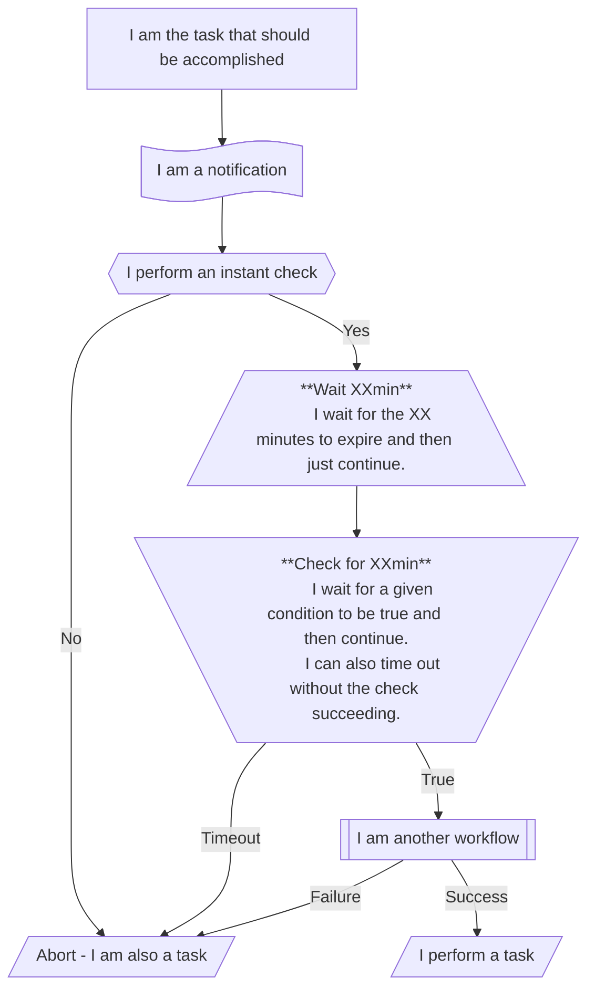
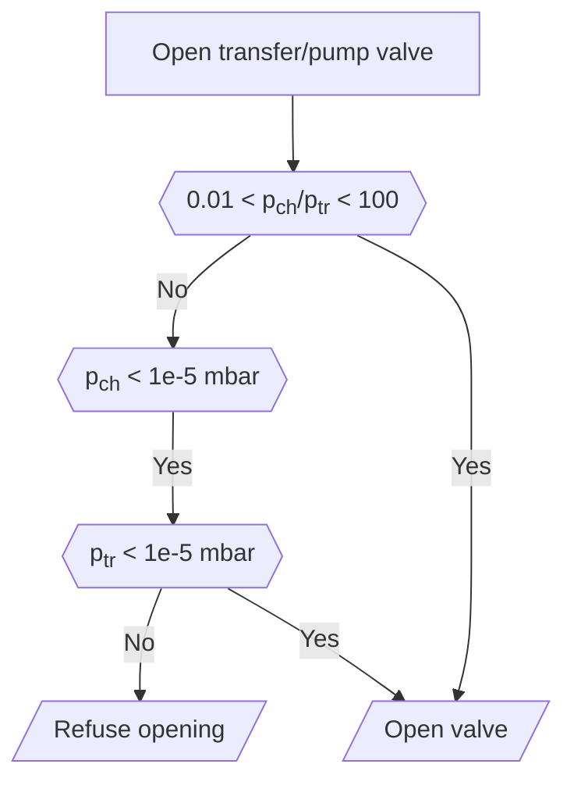
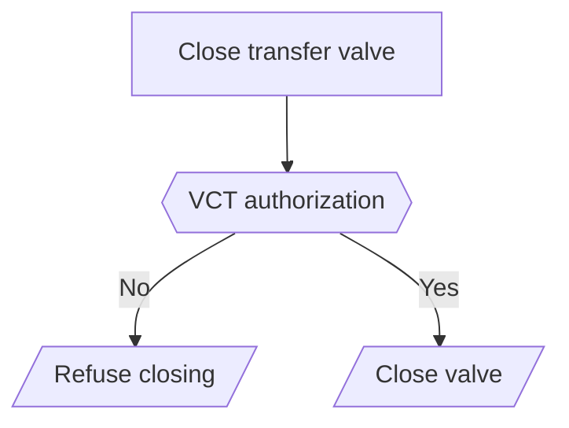
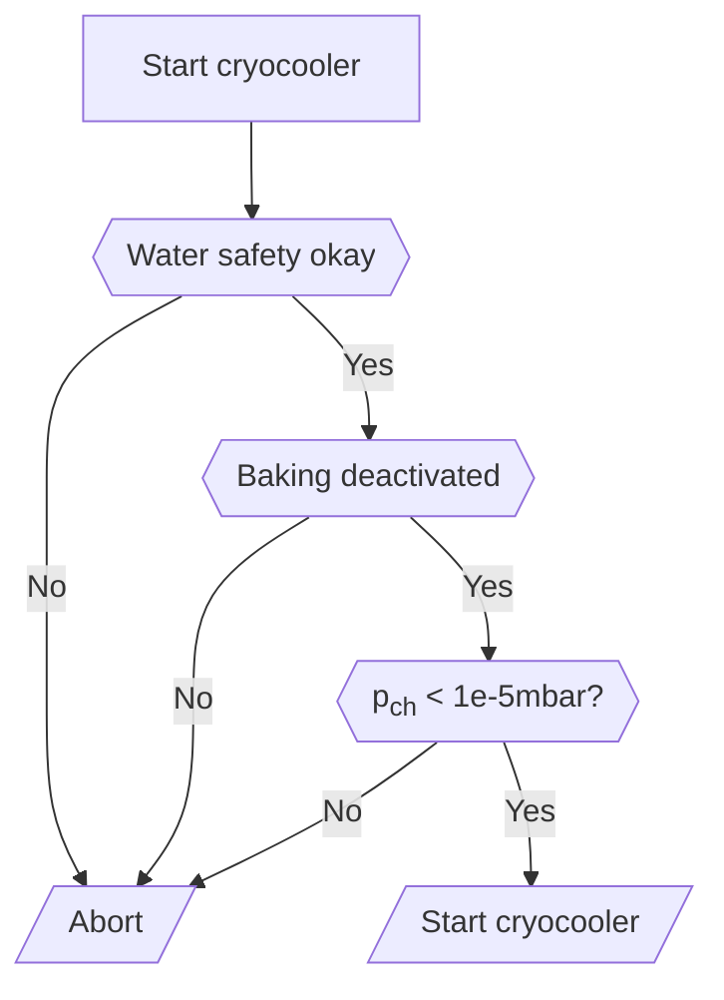
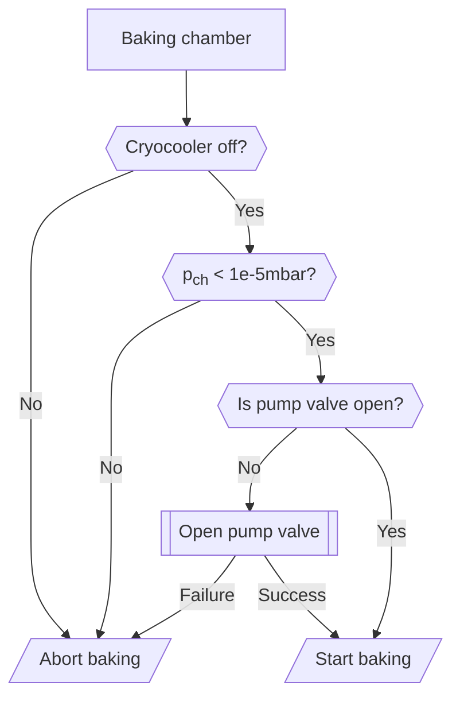
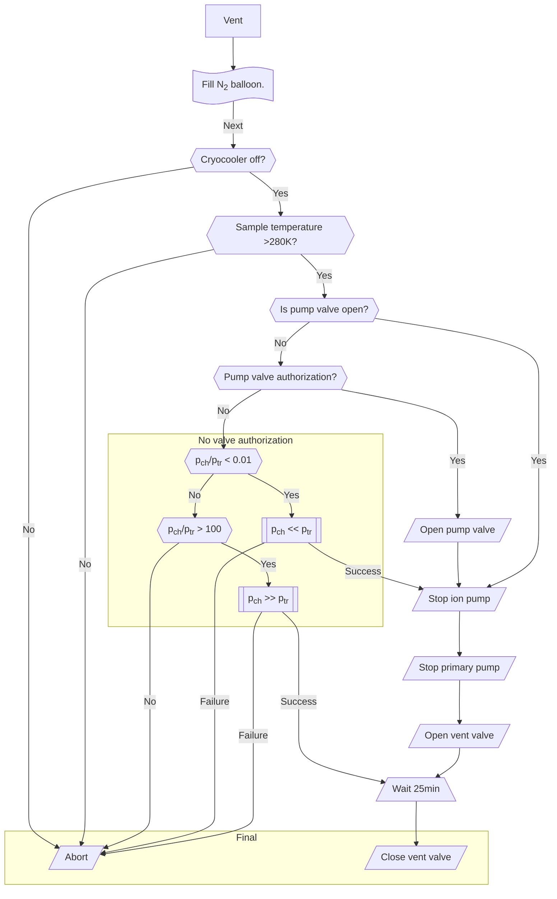
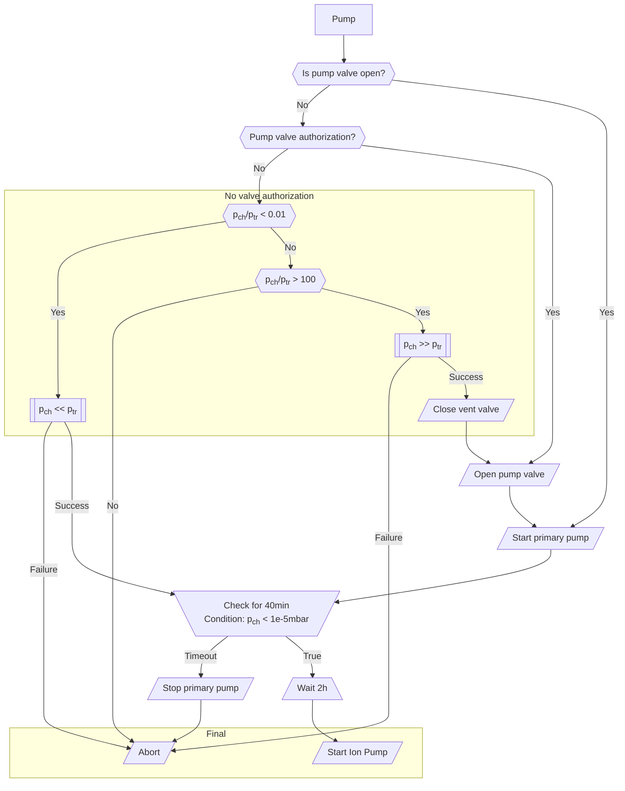
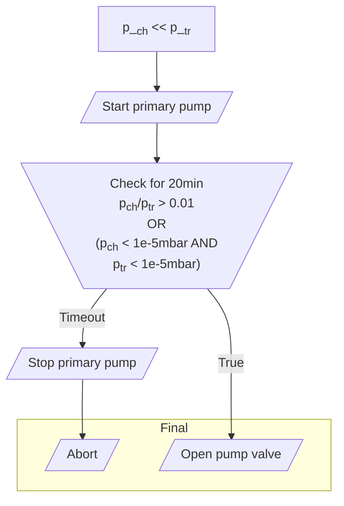
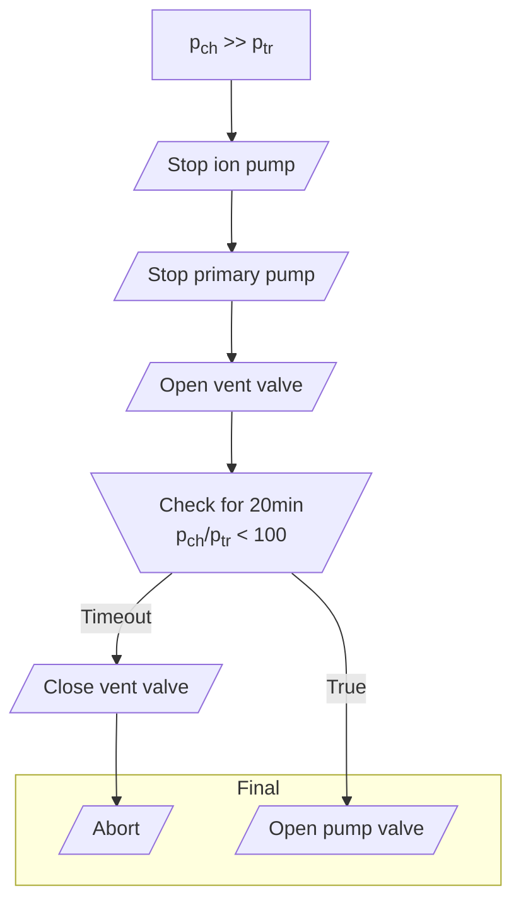

# Workflows

## Abbreviations and notation

We use the following abbreviations for all flowcharts:

- pch: pressure in sample chamber.
- ptr: pressure in transfer system.

The following symbols are used to describe the workflow:

## Open valves

This authorization is implemented in software. It checks the last read pressures
and then goes through the following flowchart. Workflows that open valves go
through this authorization as well.

## Close valves

This authorization is implemented in software and in hardware on the controller
board (see [safety section](./safety.md)). Workflows that close valves go through
this workflow as well.

> [!NOTE]
> The pump valve can be closed without any checks.

## Start cryocooler

> [!NOTE]
> Stopping the cryocooler does not require a workflow as nothing needs to be checked.

## Start baking

> [!NOTE]
> Baking can be stopped without any checks.

## Venting and pumping the system

Venting and pumping the system are two workflows that are fairly complicated.
In comparison with above simpler workflows, they compare multiple timers that can
check for a condition or just wait for the timer to expire.
Both main workflows are based on several sub workflows,
which are described further down.

> [!NOTE]
> **Pump valve authorization**
>
> These workflows do not use the workflow to open the pump valve.
> Instead, they open the pump valve directly if the authorization is there.
> Here, blocks with "Pump valve authorization" check for the same authorization
> as is the case in an open pump valve workflow.

### Vent cryostorage chamber

All variables can be specified and changed in the configuration file.
These variables are:

- Minimum sample temperature to continue.
- Wait time for opening the vent valve.

The limits that are given in the "No valve authorization" block
cannot be set.
These limits are taken from the definition of the valve opening authorization.

The user has the possibility to cancel the wait time at the end.
If this is chosen, the timer will simply stop early
and continue with the workflow,
i.e., it will close the vent valve.

### Pump cryostorage chamber

The variables that can be adjusted in this workflow are two durations.

- Maximum time allowed for primary pump to pump the chamber
  down to <10-5mbar.
- Duration to wait before the ion pump is turned on.
  If this waiting time is canceled by the user, the workflow will finish
  but not turn on the ion pump.

Again, as for the venting workflow, the pressure limits
to determine if we have pump valve opening authorization
are the same as the ones for valve authorization.

## Equalize chamber pressure

In the case where a valve cannot be opened,
these workflows to equalize the chamber pressure can be run.
These workflows are in fact important parts in the venting and pumping workflows.

### Chamber pressure low

If the chamber pressure is too low, i.e., if
\\[ \frac{p_\text{ch}}{p_\text{tr}} < 0.01, \\]
the transfer system must first be pumped before authorization
to open valves can be given.

The limits on the pressure checks that we fulfill in this flowchart
are again the same as for authorizing the pump valve to be opened.
The only configurable quantity is the timer,
which is in the flowchart set to 20 minutes.

Chamber pressure high

If the chamber pressure is too high, i.e., if
\\[ \frac{p_\text{ch}}{p_\text{tr}} > 100, \\]
the transfer system might be currently pumped and must first be vented.

Again, all pressure conditions in below flowchart
come from the open valve authorization.
The only adjustable setting is the timer.

> [!NOTE]
> The first steps in the following diagram turn off both pumps.
> These might in fact not even run at the moment.
> However, turning them off sets their status to off, i.e.,
> this process does not toggle their state.
> Thus, setting these to off is valid when calling this workflow
> from pumping and from venting.

